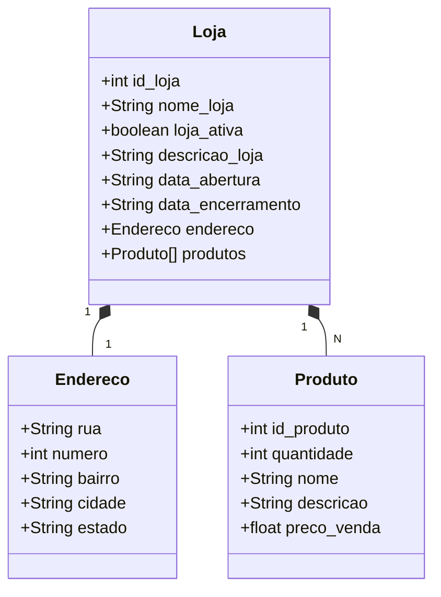

# Desafio Api DIO
Java RESTful API criada como desafio.

## Diagrama de Classes

```mermaid
classDiagram
    class Loja {
        +int id_loja
        +String nome_loja
        +boolean loja_ativa
        +String descricao_loja
        +String data_abertura
        +String data_encerramento
        +Endereco endereco
        +Produto[] produtos
    }

    class Endereco {
        +String rua
        +int numero
        +String bairro
        +String cidade
        +String estado
    }

    class Produto {
        +int id_produto
        +int quantidade
        +String nome
        +String descricao
        +float preco_venda
    }

    Loja "1" *-- "1" Endereco
    Loja "1" *-- "N" Produto
```
